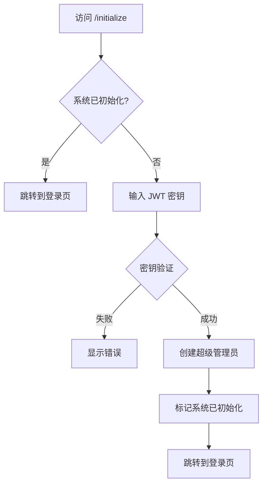

# EasyTier 节点管理系统 - 项目概览

## 🎯 项目简介

EasyTier 节点管理系统是一个基于 Cloudflare Workers 和 D1 数据库的现代化节点管理平台，提供完整的用户管理、节点管理、智能负载均衡等功能。

## ✨ 核心特性

### 🔐 安全的初始化系统
- JWT 密钥验证，确保只有授权人员可以初始化系统
- Web 界面创建超级管理员，无需操作数据库
- 一次性初始化，防止重复初始化

### 👥 三级权限管理
- **超级管理员**: 完全控制权限，可管理用户和系统设置
- **普通管理员**: 可查看所有节点和修改系统设置
- **普通用户**: 只能管理自己的节点

### ⚙️ 灵活的系统设置
- Resend 邮件服务配置（API 密钥、发件人、域名）
- 网站配置（名称、URL）
- 所有配置存储在数据库，支持动态修改

### 📊 智能节点管理
- 多种连接方式支持（TCP/UDP/WS/WSS/WG）
- 实时带宽和流量监控
- 30天负荷历史记录
- 节点状态追踪

### 🔄 智能负载均衡
- **流量优先**: 基于人均日流量分配
- **带宽优先**: 基于人均带宽分配
- **延迟优先**: 基于物理距离分配

## 📁 项目结构

```
easytierwork/
├── src/
│   ├── routes/              # API 路由
│   │   ├── auth.ts         # 用户认证
│   │   ├── nodes.ts        # 节点管理
│   │   ├── api.ts          # 公开 API
│   │   └── system.ts       # 系统管理 ⭐新增
│   ├── client/             # 前端脚本
│   │   ├── home.ts         # 首页
│   │   ├── login.ts        # 登录
│   │   ├── register.ts     # 注册
│   │   ├── dashboard.ts    # 用户仪表板
│   │   ├── admin.ts        # 管理员面板
│   │   ├── initialize.ts   # 初始化页面 ⭐新增
│   │   └── settings.ts     # 系统设置 ⭐新增
│   ├── index.tsx           # 主入口
│   ├── types.ts            # 类型定义
│   ├── utils.ts            # 工具函数
│   └── style.css           # 样式文件
├── examples/               # 示例脚本
│   ├── node_reporter.py    # 节点上报
│   ├── client_query.py     # 客户端查询
│   └── test_system.py      # 系统测试 ⭐新增
├── docs/                   # 文档
│   ├── README.md           # 项目说明
│   ├── QUICKSTART.md       # 快速开始 ⭐新增
│   ├── INITIALIZATION.md   # 初始化指南 ⭐新增
│   ├── API.md              # API 文档
│   ├── CHANGELOG.md        # 更新日志 ⭐新增
│   └── SUMMARY.md          # 功能总结 ⭐新增
├── schema.sql              # 数据库 schema
├── migration_v2.sql        # 迁移脚本 ⭐新增
└── wrangler.jsonc          # Workers 配置
```

## 🚀 快速开始

### 1. 克隆项目
```bash
git clone https://github.com/yourusername/easytier-worker.git
cd easytier-worker
npm install
```

### 2. 创建数据库
```bash
npx wrangler d1 create easytier-db
npx wrangler d1 execute easytier-db --file=./schema.sql
```

### 3. 配置环境
编辑 `wrangler.jsonc`，填入数据库 ID 和 JWT 密钥。

### 4. 本地开发
```bash
npm run dev
```

### 5. 初始化系统
访问 http://localhost:8787/initialize 完成初始化。

### 6. 部署上线
```bash
npm run deploy
```

详细步骤请查看 [QUICKSTART.md](./QUICKSTART.md)

## 📚 文档导航

| 文档 | 说明 |
|------|------|
| [README.md](./README.md) | 项目概述和基本信息 |
| [QUICKSTART.md](./QUICKSTART.md) | 快速开始指南，适合新手 |
| [INITIALIZATION.md](./INITIALIZATION.md) | 系统初始化和管理详细指南 |
| [API.md](./API.md) | 完整的 API 文档 |
| [CHANGELOG.md](./CHANGELOG.md) | 版本更新日志 |
| [SUMMARY.md](./SUMMARY.md) | 功能实现总结 |
| [examples/README.md](./examples/README.md) | 示例脚本使用说明 |

## 🔑 核心概念

### 初始化流程



### 权限系统

```
超级管理员 (Super Admin)
├── 管理用户
│   ├── 授予管理员权限
│   ├── 撤销管理员权限
│   └── 删除用户
├── 管理系统设置
├── 查看所有节点
└── 管理自己的节点

普通管理员 (Admin)
├── 管理系统设置
├── 查看所有节点
└── 管理自己的节点

普通用户 (User)
└── 管理自己的节点
```

### 负载均衡算法

**流量优先算法：**
```
人均日流量 = (最大流量 - 已用流量) / 重置天数 / 当前连接数
优先分配人均日流量高的节点
```

**带宽优先算法：**
```
人均带宽 = 当前阶梯带宽 / 当前连接数
优先分配人均带宽高的节点
```

**延迟优先算法：**
```
根据客户端 IP 和节点地域计算物理距离
优先分配距离近的节点
```

## 🛠️ 技术栈

| 技术 | 用途 |
|------|------|
| Hono | Web 框架 |
| Cloudflare Workers | 运行环境 |
| Cloudflare D1 | 数据库 (SQLite) |
| TypeScript | 编程语言 |
| JSX | 模板引擎 |
| Resend | 邮件服务 |
| bcrypt | 密码加密 |
| JWT | 身份认证 |

## 📊 数据库设计

### users 表
存储用户信息，包括邮箱、密码、权限等。

### nodes 表
存储节点信息，包括名称、地域、连接方式、带宽、流量等。

### system_settings 表 ⭐新增
存储系统配置，包括 Resend 配置、网站配置等。

## 🔒 安全特性

- ✅ JWT 密钥验证初始化
- ✅ bcrypt 密码加密
- ✅ JWT Token 认证
- ✅ 权限分级管理
- ✅ HTTPS 加密传输
- ✅ SQL 注入防护
- ✅ XSS 防护

## 🌟 亮点功能

### 1. 零数据库操作初始化
用户无需执行任何 SQL 命令，通过 Web 界面即可完成系统初始化。

### 2. 动态配置管理
所有系统配置存储在数据库中，修改后立即生效，无需重新部署。

### 3. 智能负载均衡
根据不同优先级策略，智能分配最优节点给客户端。

### 4. 完整的权限系统
三级权限设计，满足不同场景的管理需求。

### 5. 响应式设计
前端界面适配各种设备，提供良好的用户体验。

## 📈 性能指标

- **响应时间**: < 100ms（全球边缘网络）
- **并发支持**: 无限制（Cloudflare Workers）
- **数据库**: 10GB 免费额度
- **请求**: 100,000 次/天（免费版）

## 🤝 贡献指南

欢迎贡献代码、报告问题、提出建议！

1. Fork 项目
2. 创建特性分支 (`git checkout -b feature/AmazingFeature`)
3. 提交更改 (`git commit -m 'Add some AmazingFeature'`)
4. 推送到分支 (`git push origin feature/AmazingFeature`)
5. 开启 Pull Request

## 📝 许可证

本项目采用 GPL-3.0 许可证。详见 [LICENSE](./LICENSE) 文件。

## 🙏 致谢

- [Hono](https://hono.dev/) - 优秀的 Web 框架
- [Cloudflare](https://www.cloudflare.com/) - 强大的边缘计算平台
- [Resend](https://resend.com/) - 现代化的邮件服务
- [EasyTier](https://github.com/EasyTier/EasyTier) - 灵感来源

## 📞 联系方式

- 项目主页: https://github.com/yourusername/easytier-worker
- 问题反馈: https://github.com/yourusername/easytier-worker/issues
- 邮箱: your-email@example.com

## 🗺️ 路线图

### v2.1.0 (计划中)
- [ ] 密码重置功能
- [ ] 用户活动日志
- [ ] 系统操作审计
- [ ] 邮件模板优化

### v3.0.0 (未来)
- [ ] OAuth 登录支持
- [ ] 双因素认证
- [ ] API 密钥管理
- [ ] Webhook 支持
- [ ] 数据导出功能
- [ ] 多语言支持

---

**当前版本**: v2.0.0  
**最后更新**: 2025-01-04  
**维护状态**: 🟢 活跃开发中