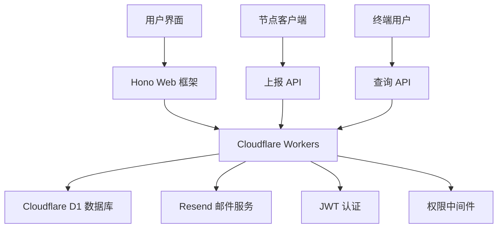

# EasyTier 节点管理系统

🚀 **现代化的 EasyTier 节点管理平台**，让节点管理变得简单高效！

[](LICENSE)
[](https://workers.cloudflare.com/)
[](https://www.typescriptlang.org/)

> 基于 Cloudflare Workers 和 D1 数据库构建的现代化节点管理系统，提供完整的用户权限管理、智能负载均衡和实时监控功能。

---

## ✨ 为什么选择我们？

### 🎯 **开箱即用**
- 零配置部署，一键初始化
- 可视化管理界面，无需命令行操作
- 内置智能负载均衡算法

### 🔐 **企业级安全**
- JWT 密钥验证的初始化机制
- 三级权限管理体系
- bcrypt 加密存储密码

### 📊 **智能监控**
- 实时节点状态监控
- 30天负荷历史记录
- 多维度统计分析

### 🌍 **全球部署**
- 基于 Cloudflare 边缘网络
- 自动全球 CDN 加速
- 99.9% 可用性保证

---

## 🚀 快速体验

### 1. 一键部署

```bash
# 克隆项目
git clone https://github.com/yourusername/easytierwork.git
cd easytierwork

# 安装依赖
npm install

# 创建数据库
npx wrangler d1 create easytier-db

# 配置环境（编辑 wrangler.jsonc）
# 填入你的 database_id 和 JWT_SECRET

# 部署到 Cloudflare
npm run deploy
```

### 2. 初始化系统

访问 `https://your-domain.workers.dev/initialize`，只需三步：

1. 🔑 输入 JWT 密钥（来自配置文件）
2. 📧 设置超级管理员邮箱
3. 🔐 创建管理员密码

就这么简单！系统会自动创建所有必需的数据表和配置。

### 3. 开始使用

- 👤 **管理员**: 登录后台管理节点和用户
- 📱 **用户**: 注册账户并添加自己的节点
- 🔌 **开发者**: 使用 API 接入客户端

---

## 🎬 功能演示

### 📈 **智能负载均衡**

我们提供三种智能负载均衡策略：

```python
# 流量优先 - 基于人均日流量
response = requests.post('/api/query', {
    "region": "domestic",
    "priority": "traffic"
})

# 带宽优先 - 基于人均带宽  
response = requests.post('/api/query', {
    "region": "overseas", 
    "priority": "bandwidth"
})

# 延迟优先 - 基于连接数量
response = requests.post('/api/query', {
    "priority": "latency"
})
```

### 📊 **节点监控面板**

实时展示关键指标：
- 🌐 总节点数：在线/离线状态
- 📶 总带宽：当前/阶梯/最大带宽
- 👥 连接数：实时连接统计
- 📈 流量使用：已用/剩余流量

### 🔐 **权限管理体系**

```
超级管理员 ─────┬── 管理所有用户
               ├── 修改系统设置  
               └── 查看所有节点

普通管理员 ─────┬── 查看所有节点
               ├── 修改系统设置
               └── 管理自己的节点

普通用户 ────────┴── 管理自己的节点
```

---

## 📋 核心功能

### 👥 **用户管理**
- ✅ 用户注册与邮箱验证
- ✅ JWT 安全认证
- ✅ 密码加密存储
- ✅ 三级权限控制

### 🖥️ **节点管理** 
- ✅ 多连接方式支持（TCP/UDP/WS/WSS/WG）
- ✅ 实时状态监控
- ✅ 带宽与流量统计
- ✅ 自定义标签和备注
- ✅ 中转功能开关

### 🤖 **智能 API**
- ✅ 节点自动上报（Token 验证）
- ✅ 智能负载均衡查询
- ✅ 地域筛选（国内/海外）
- ✅ 统计信息接口

### ⚙️ **系统管理**
- ✅ Web 界面初始化
- ✅ 动态系统配置
- ✅ 邮件服务集成（Resend）
- ✅ 用户权限管理

---

## 🛠️ 技术架构



### 技术栈

| 组件 | 技术选型 | 说明 |
|------|----------|------|
| **运行环境** | Cloudflare Workers | 全球边缘网络，零冷启动 |
| **数据库** | Cloudflare D1 | 兼容 SQLite，10GB 免费 |
| **Web 框架** | Hono | 轻量级，TypeScript 原生支持 |
| **前端** | TypeScript + JSX | 组件化开发，类型安全 |
| **认证** | JWT | 无状态认证，支持分布式 |
| **加密** | bcrypt | 密码哈希，防彩虹表攻击 |
| **邮件** | Resend | 现代化邮件服务 |

---

## 📁 项目结构

```
easytierwork/
├── 📂 src/                    # 源代码
│   ├── 📂 routes/            # API 路由
│   │   ├── auth.ts          # 用户认证
│   │   ├── nodes.ts         # 节点管理  
│   │   ├── api.ts           # 公开 API
│   │   └── system.ts        # 系统管理
│   ├── 📂 client/           # 前端脚本
│   │   ├── home.ts         # 首页逻辑
│   │   ├── dashboard.ts    # 仪表板
│   │   ├── admin.ts        # 管理面板
│   │   └── settings.ts     # 系统设置
│   ├── index.tsx           # 应用入口
│   ├── types.ts            # 类型定义
│   ├── utils.ts            # 工具函数
│   └── style.css           # 样式文件
├── 📂 examples/             # 示例脚本
│   ├── node_reporter.py    # 节点上报
│   ├── client_query.py     # 客户端查询
│   └── test_system.py      # 系统测试
├── 📂 docs/                # 核心文档
│   ├── README.md          # 完整使用指南
│   ├── API.md             # API 接口文档
│   └── CONTRIBUTING.md    # 贡献指南
├── schema.sql             # 数据库结构
├── wrangler.jsonc         # Cloudflare 配置
└── package.json           # 项目配置
```

---

## 🎯 使用场景

### 🏢 **企业级应用**
- 内部网络节点管理
- VPN 服务节点监控
- 负载均衡集群管理

### 🌐 **服务提供商**
- CDN 节点管理
- 游戏加速服务
- 视频流媒体分发

### 👥 **社区项目**
- 开源网络项目
- 学术研究平台
- 技术演示系统

---

## 📖 API 示例

### 🔗 节点上报
```bash
curl -X POST https://your-domain.workers.dev/api/report \
  -H "Content-Type: application/json" \
  -d '{
    "node_name": "beijing-node-1",
    "email": "admin@example.com", 
    "token": "your-secret-token",
    "current_bandwidth": 150.5,
    "reported_traffic": 2.3,
    "connection_count": 25,
    "status": "online"
  }'
```

### 🔍 智能查询
```bash
curl -X POST https://your-domain.workers.dev/api/query \
  -H "Content-Type: application/json" \
  -d '{
    "region": "domestic",
    "priority": "traffic",
    "relay_only": false
  }'
```

### 📊 获取统计
```bash
curl https://your-domain.workers.dev/api/stats
```

---

## 🛡️ 安全特性

### 🔒 **多层安全防护**
- **初始化安全**: JWT 密钥验证，防止恶意初始化
- **传输安全**: 强制 HTTPS，数据加密传输  
- **认证安全**: JWT Token + bcrypt 密码加密
- **权限安全**: 细粒度权限控制，最小权限原则
- **数据安全**: SQL 注入防护，XSS 防护

### 🚨 **安全最佳实践**
- ✅ 强制 HTTPS 连接
- ✅ 密码强度要求（最少 6 位）
- ✅ JWT Token 过期机制
- ✅ SQL 参数化查询
- ✅ 输入数据验证和清理
- ✅ CORS 跨域保护

---

## 📊 性能指标

| 指标 | 数值 | 说明 |
|------|------|------|
| **响应时间** | < 100ms | 全球边缘网络 |
| **并发支持** | 无限制 | Cloudflare Workers |
| **数据库容量** | 10GB | 免费额度 |
| **日请求数** | 100万+ | 免费额度 |
| **可用性** | 99.9% | Cloudflare SLA |

---

## 🔧 开发指南

### 🏗️ 本地开发
```bash
# 安装依赖
npm install

# 启动开发服务器
npm run dev

# 访问 http://localhost:8787
```

### 📝 添加新功能
1. 在 `src/routes/` 创建新的路由文件
2. 在 `src/index.tsx` 注册路由
3. 更新 API 文档

### 🧪 运行测试
```bash
# 测试 API 接口
cd examples
python test_system.py

# 测试负载均衡
python client_query.py
```

---

## 📚 核心文档

| 文档 | 说明 |
|------|------|
| [📖 docs/README.md](./docs/README.md) | 完整使用指南 - 包含快速开始、用户管理、API使用等 ⭐ |
| [🔧 docs/API.md](./docs/API.md) | 完整的 API 接口文档 |
| [🤝 docs/CONTRIBUTING.md](./docs/CONTRIBUTING.md) | 贡献指南 - 欢迎提交代码和建议 |

---

## 🆘 常见问题

### ❓ **系统初始化失败？**
确保 JWT 密钥正确，检查 `wrangler.jsonc` 配置。

### ❓ **邮件发送不成功？**  
检查 Resend API 密钥和域名验证状态。

### ❓ **节点上报 Token 无效？**
在节点管理页面重新生成 Token。

### ❓ **查询返回空结果？**
检查节点状态是否为 online，地域筛选是否正确。

---

## 🤝 贡献指南

我们欢迎所有形式的贡献！

### 🌟 **贡献方式**
- 🐛 报告 Bug
- 💡 提出功能建议  
- 📝 改进文档
- 🔧 提交代码

### 📋 **提交流程**
1. Fork 项目
2. 创建特性分支
3. 提交更改
4. 发起 Pull Request

---

## 📞 联系我们

- 📧 **邮箱**: your-email@example.com
- 🐛 **问题反馈**: [GitHub Issues](https://github.com/yourusername/easytierwork/issues)
- 📖 **文档**: [在线文档](https://your-domain.workers.dev/docs)
- 💬 **交流群**: [加入讨论](https://github.com/yourusername/easytierwork/discussions)

---

## 📜 开源协议

本项目基于 [GPL-3.0 协议](LICENSE) 开源，允许自由使用、修改和分发。

---

<div align="center">

**⭐ 如果这个项目对你有帮助，请给我们一个 Star！**

Made with ❤️ by EasyTier Team

</div>