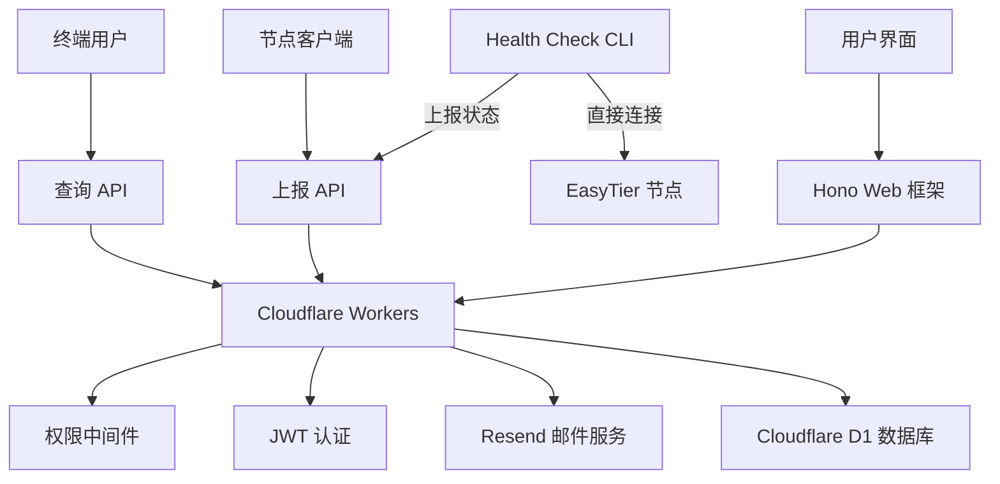

# EasyTier 节点管理系统

🚀 **现代化的 EasyTier 节点管理平台**，让节点管理变得简单高效！

[](LICENSE)
[](https://workers.cloudflare.com/)
[](https://www.typescriptlang.org/)
[](https://www.rust-lang.org/)
[](https://www.docker.com/)
[](https://github.com/features/actions)

> 基于 Cloudflare Workers 和 D1 数据库构建的现代化节点管理系统，提供完整的用户权限管理、智能负载均衡和实时监控功能。

---

## ✨ 为什么选择我们？

### 🎯 **开箱即用**
- 零配置部署，一键初始化
- 可视化管理界面，无需命令行操作
- 内置智能负载均衡算法

### 🔐 **企业级安全**
- JWT 密钥验证的初始化机制
- 三级权限管理体系
- bcrypt 加密存储密码

### 📊 **智能监控**
- 实时节点状态监控
- 30天负荷历史记录
- 多维度统计分析

### 🌍 **全球部署**
- 基于 Cloudflare 边缘网络
- 自动全球 CDN 加速
- 99.9% 可用性保证

---

## 🚀 快速体验

本项目支持两种部署方式：**Docker 本地部署**（推荐自托管）和 **Cloudflare Workers 部署**（推荐生产）。

---

### 🐳 方式一：Docker 部署（自托管）

> 适合本地或私有服务器部署，包含前后端 + 健康检测，开箱即用。

#### 前置准备

将 Linux 版 `health-check` 可执行文件放入 `health/` 目录，或从 [Releases](../../releases) 页面下载预编译版本：

```
health/
├── src/
├── Cargo.toml
├── Dockerfile
└── ...
```

#### 启动服务

```bash
# 克隆项目
git clone https://github.com/EasyTierTeam/EasyTierWork.git
cd EasyTierWork

# 编辑 wrangler.jsonc，填入 JWT_SECRET 等配置
# 然后一键启动
JWT_SECRET=your-secret-key docker compose up -d --build
```

或使用 `.env` 文件管理环境变量：

```bash
# 创建 .env 文件
cat > .env <<EOF
JWT_SECRET=your-secret-key
MONITOR_JWT_TOKEN=your-admin-jwt-token
MONITOR_LOG_LEVEL=INFO
EOF

docker compose up -d --build
```

#### 服务说明

| 服务 | 容器名 | 端口 | 说明 |
|------|--------|------|------|
| `app` | `easytier-app` | `8787` | Hono 前后端，wrangler dev 本地模式 |
| `health-check` | `easytier-health` | — | Rust 健康检测 CLI，可配合监控脚本使用 |

- **app** 健康检查通过后，**health-check** 才会自动启动
- D1 数据库持久化在 Docker volume `wrangler_state` 中
- 访问 `http://localhost:8787` 进入管理界面

#### 环境变量参考

| 变量 | 默认值 | 说明 |
|------|--------|------|
| `JWT_SECRET` | `change-me-in-production` | JWT 签名密钥，**必须修改** |
| `MONITOR_JWT_TOKEN` | 空 | Monitor 使用的管理员 JWT Token |
| `MONITOR_LOG_LEVEL` | `INFO` | Monitor 日志级别（DEBUG/INFO/WARNING/ERROR）|
| `ENABLE_EMAIL_VERIFICATION` | `false` | 是否开启邮箱验证 |
| `SITE_NAME` | `EasyTier 节点管理系统` | 站点名称 |
| `EDGEONE_API_URL` | 空 | EdgeOne 云函数地址（配置后启用远程检测） |
| `EDGEONE_API_KEY` | 空 | 调用 EdgeOne 云函数的 API Key |
| `EDGEONE_CHECK_TIMEOUT` | `30000` | EdgeOne 检测超时时间（毫秒） |

#### 常用命令

```bash
# 查看日志
docker compose logs -f

# 仅查看 monitor 日志
docker compose logs -f monitor

# 重启服务
docker compose restart

# 停止并清理
docker compose down
```

---

### ☁️ 方式二：Cloudflare Workers 部署

> 适合生产环境，享受全球边缘网络和免费额度。

```bash
# 克隆项目
git clone https://github.com/EasyTierTeam/EasyTierWork.git
cd EasyTierWork

# 安装依赖
npm install

# 创建数据库
npx wrangler d1 create easytier-db

# 配置环境（编辑 wrangler.jsonc）
# 填入你的 database_id 和 JWT_SECRET

# 部署到 Cloudflare
npm run deploy
```

---

### 🌐 方式三：EdgeOne Pages 云函数部署

> 适合需要在中国大陆访问的场景，利用腾讯云 EdgeOne 边缘网络加速。支持两种部署模式。

#### 模式一：独立云函数部署

将 Python 云函数部署到 EdgeOne Pages，作为独立的节点检测代理，转发检测请求到 Hono 主服务。

1. 在 EdgeOne Pages 控制台创建项目，选择「从本地目录部署」
2. 将 `py-functions/` 目录作为部署根目录
3. 配置环境变量：

| 变量 | 必填 | 说明 |
|------|------|------|
| `HONO_API_URL` | ✅ | Hono 主服务地址（如 `https://your-app.workers.dev`） |
| `API_KEY` | ❌ | API 鉴权密钥，保护检测接口 |
| `HONO_API_KEY` | ❌ | 调用 Hono 接口时使用的 API Key |
| `CHECK_TIMEOUT` | ❌ | 检测超时时间（秒，默认 30） |

4. 部署后访问 `https://your-edgeone-domain/api/edgeone/health` 验证服务状态

#### 模式二：一体化部署（Hono 内置路由）

在 Hono 主服务中配置 EdgeOne 检测环境变量，使用内置的检测路由：

1. 在 `wrangler.jsonc` 中添加环境变量：

| 变量 | 必填 | 说明 |
|------|------|------|
| `EDGEONE_API_URL` | ❌ | EdgeOne 云函数地址（配置后使用远程检测，否则使用本地 TCP 检测） |
| `EDGEONE_API_KEY` | ❌ | 调用 EdgeOne 云函数时的 API Key |
| `EDGEONE_CHECK_TIMEOUT` | ❌ | 检测超时时间（毫秒，默认 30000） |

2. 检测路由自动注册，无需额外代码：

| 路由 | 方法 | 说明 |
|------|------|------|
| `/api/edgeone/check` | GET | 单节点在线检测 |
| `/api/edgeone/batch-check` | POST | 批量节点在线检测（最多 20 个） |
| `/api/edgeone/health` | GET | 云函数健康状态 |

#### 调用示例

```bash
# 单节点检测
curl "https://your-domain/api/edgeone/check?server=tcp://1.2.3.4:11010&network_name=MyNet&network_secret=MyPass" \
  -H "X-API-Key: your-api-key"

# 批量检测
curl -X POST "https://your-domain/api/edgeone/batch-check" \
  -H "Content-Type: application/json" \
  -H "X-API-Key: your-api-key" \
  -d '{
    "nodes": [
      {"server": "tcp://1.2.3.4:11010", "network_name": "MyNet", "network_secret": "MyPass"},
      {"server": "ws://5.6.7.8:11011", "network_name": "TestNet", "network_secret": "TestPass"}
    ]
  }'
```

---

### 🤖 自动构建镜像（GitHub Actions）

推送到 `main` 分支或打 `v*` tag 时，GitHub Actions 会自动构建并推送镜像到 GHCR：

```
ghcr.io/<owner>/<repo>/app:latest
ghcr.io/<owner>/<repo>/monitor:latest
ghcr.io/<owner>/<repo>/health-check:latest
```

可直接在 `docker-compose.yml` 中将 `build` 替换为 `image` 字段使用预构建镜像。

#### Health Check CLI 预构建二进制

每次推送到 `main` 分支，GitHub Actions 还会自动编译 Health Check CLI 的多平台二进制文件，并发布到 **Beta Release**：

| 文件名 | 平台 | 架构 |
|--------|------|------|
| `health-check-linux-x86_64` | Linux | x86_64 |
| `health-check-linux-aarch64` | Linux | ARM64 |
| `health-check-linux-armv7` | Linux | ARMv7 |
| `health-check-windows-x86_64.exe` | Windows | x86_64 |
| `health-check-macos-x86_64` | macOS | x86_64 |
| `health-check-macos-aarch64` | macOS | Apple Silicon |

> 在 [Releases](../../releases) 页面找到最新的 `beta-health-*` 预发布版本下载。

---

### 初始化系统

部署完成后，访问管理界面的 `/initialize` 页面，只需三步：

1. 🔑 输入 JWT 密钥（来自配置文件）
2. 📧 设置超级管理员邮箱
3. 🔐 创建管理员密码

就这么简单！系统会自动创建所有必需的数据表和配置。

### 开始使用

- 👤 **管理员**: 登录后台管理节点和用户
- 📱 **用户**: 注册账户并添加自己的节点
- 🔌 **开发者**: 使用 API 接入客户端

---

## 🎬 功能演示

### 📈 **智能负载均衡**

我们提供三种智能负载均衡策略：

```python
# 流量优先 - 基于人均日流量
response = requests.post('/api/query', {
    "region": "domestic",
    "priority": "traffic"
})

# 带宽优先 - 基于人均带宽  
response = requests.post('/api/query', {
    "region": "overseas", 
    "priority": "bandwidth"
})

# 延迟优先 - 基于连接数量
response = requests.post('/api/query', {
    "priority": "latency"
})
```

### 📊 **节点监控面板**

实时展示关键指标：
- 🌐 总节点数：在线/离线状态
- 📶 总带宽：当前/阶梯/最大带宽
- 👥 连接数：实时连接统计
- 📈 流量使用：已用/剩余流量

### 🔐 **权限管理体系**

```
超级管理员 ─────┬── 管理所有用户
               ├── 修改系统设置  
               └── 查看所有节点

普通管理员 ─────┬── 查看所有节点
               ├── 修改系统设置
               └── 管理自己的节点

普通用户 ────────┴── 管理自己的节点
```

---

## 📋 核心功能

### 👥 **用户管理**
- ✅ 用户注册与邮箱验证
- ✅ JWT 安全认证
- ✅ 密码加密存储
- ✅ 三级权限控制

### 🖥️ **节点管理** 
- ✅ 多连接方式支持（TCP/UDP/WS/WSS/WG）
- ✅ 实时状态监控
- ✅ 带宽与流量统计
- ✅ 自定义标签和备注
- ✅ 中转功能开关

### 🤖 **智能 API**
- ✅ 节点自动上报（Token 验证）
- ✅ 智能负载均衡查询
- ✅ 地域筛选（国内/海外）
- ✅ 统计信息接口

### ⚙️ **系统管理**
- ✅ Web 界面初始化
- ✅ 动态系统配置
- ✅ 邮件服务集成（Resend）
- ✅ 用户权限管理

---

## 🛠️ 技术架构


```mermaid
graph TB
    A[用户界面] --> B[Hono Web 框架]
    B --> C[Cloudflare Workers]
    C --> D[Cloudflare D1 数据库]
    C --> E[Resend 邮件服务]
    
    F[节点客户端] --> G[上报 API]
    G --> C
    
    H[终端用户] --> I[查询 API]
    I --> C
    
    J[Health Check CLI] -->|直接连接| K[EasyTier 节点]
    J -->|上报状态| G
    
    C --> L[JWT 认证]
    C --> M[权限中间件]
```

### 技术栈

| 组件 | 技术选型 | 说明 |
|------|----------|------|
| **运行环境** | Cloudflare Workers | 全球边缘网络，零冷启动 |
| **数据库** | Cloudflare D1 | 兼容 SQLite，10GB 免费 |
| **Web 框架** | Hono | 轻量级，TypeScript 原生支持 |
| **前端** | TypeScript + JSX | 组件化开发，类型安全 |
| **认证** | JWT | 无状态认证，支持分布式 |
| **加密** | bcrypt | 密码哈希，防彩虹表攻击 |
| **邮件** | Resend | 现代化邮件服务 |
| **Health Check** | Rust | 静态二进制，跨平台健康检测 |

---

## 📁 项目结构

```
easytierwork/
├── 📂 src/                    # 源代码
│   ├── 📂 routes/            # API 路由
│   │   ├── auth.ts          # 用户认证
│   │   ├── nodes.ts         # 节点管理  
│   │   ├── api.ts           # 公开 API
│   │   └── system.ts        # 系统管理
│   ├── 📂 client/           # 前端脚本
│   │   ├── home.ts         # 首页逻辑
│   │   ├── dashboard.ts    # 仪表板
│   │   ├── admin.ts        # 管理面板
│   │   └── settings.ts     # 系统设置
│   ├── index.tsx           # 应用入口
│   ├── edgeone.ts          # EdgeOne 云函数检测模块
│   ├── types.ts            # 类型定义
│   ├── utils.ts            # 工具函数
│   └── style.css           # 样式文件
├── 📂 health/               # Health Check CLI（Rust）
│   ├── 📂 src/             # Rust 源码
│   │   └── main.rs        # 主程序
│   ├── 📂 examples/        # 使用示例
│   │   ├── check_nodes.py # Python 批量检测示例
│   │   └── check_nodes.bat# Windows 批量检测示例
│   ├── Cargo.toml         # Rust 项目配置
│   ├── Dockerfile         # Health Check 镜像构建文件
│   ├── build.sh           # Linux/macOS 构建脚本
│   └── build.bat          # Windows 构建脚本
├── 📂 docker/              # Docker 相关文件
│   ├── Dockerfile         # App 镜像构建文件
│   ├── docker-compose.yml # Docker Compose 编排
│   ├── .dockerignore      # Docker 构建忽略规则
│   └── entrypoint.sh      # 容器启动脚本
├── 📂 .github/workflows/   # CI/CD
│   ├── docker-publish.yml # 自动构建并推送 App/Monitor 镜像到 GHCR
│   └── health-release.yml # 构建 Health Check 二进制 + Docker 镜像，发布 Beta Release
├── 📂 examples/             # 示例脚本
│   ├── node_reporter.py    # 节点上报
│   ├── client_query.py     # 客户端查询
│   └── test_system.py      # 系统测试
├── 📂 py-functions/          # EdgeOne Python 云函数
│   └── 📂 api/edgeone/     # EdgeOne 检测接口
│       ├── check.py       # 单节点检测
│       ├── health.py      # 健康状态
│       └── batch-check.py # 批量检测
├── 📂 docs/                # 核心文档
│   ├── README.md          # 完整使用指南
│   ├── API.md             # API 接口文档
│   └── CONTRIBUTING.md    # 贡献指南
├── Dockerfile             # App 镜像构建文件
├── docker-compose.yml     # Docker Compose 编排
├── .dockerignore          # Docker 构建忽略规则
├── schema.sql             # 数据库结构
├── wrangler.jsonc         # Cloudflare 配置
└── package.json           # 项目配置
```

---

## 🏥 Health Check CLI

`health/` 目录包含一个独立的 Rust 命令行工具，用于检查 EasyTier 节点的健康状态，可配合监控系统或脚本使用。

### 功能特性

- 🦀 **纯 Rust 实现**，单一静态二进制，无运行时依赖
- 🌐 **多协议支持**：TCP / UDP / WS / WSS / WG
- 📊 **结构化输出**：返回在线状态、连接数等指标
- ⏱️ **可配置超时**，适合批量脚本调用
- 🐳 **Docker 支持**，可容器化部署

### 快速使用

**下载预编译二进制**（推荐）：

前往 [Releases](../../releases) 页面下载对应平台的 `beta-health-*` 版本。

**从源码编译**：

```bash
cd health
cargo build --release
# 产物：health/target/release/health-check
```

**基本用法**：

```bash
# 检查节点健康状态
health-check -s tcp://192.168.1.1:11010 -n MyNetwork -p MyPassword

# 输出格式：<是否在线> <连接数> <带宽> <阶梯带宽> <已用流量>
# 示例输出：1 100 0 0 0
```

**Docker 使用**：

```bash
docker pull ghcr.io/<owner>/<repo>/health-check:latest
docker run --rm ghcr.io/<owner>/<repo>/health-check \
  -s tcp://192.168.1.1:11010 -n MyNetwork -p MyPassword
```

**参数说明**：

| 参数 | 说明 | 示例 |
|------|------|------|
| `-s, --server` | 服务器地址（协议://IP:端口） | `tcp://192.168.1.1:11010` |
| `-n, --network-name` | 网络名称 | `MyNetwork` |
| `-p, --network-secret` | 网络密码 | `MyPassword` |
| `-t, --timeout` | 超时时间（秒，默认 30） | `60` |
| `-v, --verbose` | 启用详细日志 | — |

> 详细文档见 [health/README.md](health/README.md)

---

## 🎯 使用场景

### 🏢 **企业级应用**
- 内部网络节点管理
- VPN 服务节点监控
- 负载均衡集群管理

### 🌐 **服务提供商**
- CDN 节点管理
- 游戏加速服务
- 视频流媒体分发

### 👥 **社区项目**
- 开源网络项目
- 学术研究平台
- 技术演示系统

---

## 📖 API 示例

### 🔗 节点上报
```bash
curl -X POST https://your-domain.workers.dev/api/report \
  -H "Content-Type: application/json" \
  -d '{
    "node_name": "beijing-node-1",
    "email": "admin@example.com", 
    "token": "your-secret-token",
    "current_bandwidth": 150.5,
    "reported_traffic": 2.3,
    "connection_count": 25,
    "status": "online"
  }'
```

### 🔍 智能查询
```bash
curl -X POST https://your-domain.workers.dev/api/query \
  -H "Content-Type: application/json" \
  -d '{
    "region": "domestic",
    "priority": "traffic",
    "relay_only": false
  }'
```

### 📊 获取统计
```bash
curl https://your-domain.workers.dev/api/stats
```

---

## 🛡️ 安全特性

### 🔒 **多层安全防护**
- **初始化安全**: JWT 密钥验证，防止恶意初始化
- **传输安全**: 强制 HTTPS，数据加密传输  
- **认证安全**: JWT Token + bcrypt 密码加密
- **权限安全**: 细粒度权限控制，最小权限原则
- **数据安全**: SQL 注入防护，XSS 防护

### 🚨 **安全最佳实践**
- ✅ 强制 HTTPS 连接
- ✅ 密码强度要求（最少 6 位）
- ✅ JWT Token 过期机制
- ✅ SQL 参数化查询
- ✅ 输入数据验证和清理
- ✅ CORS 跨域保护

---

## 📊 性能指标

| 指标 | 数值 | 说明 |
|------|------|------|
| **响应时间** | < 100ms | 全球边缘网络 |
| **并发支持** | 无限制 | Cloudflare Workers |
| **数据库容量** | 10GB | 免费额度 |
| **日请求数** | 100万+ | 免费额度 |
| **可用性** | 99.9% | Cloudflare SLA |

---

## 🔧 开发指南

### 🏗️ 本地开发
```bash
# 安装依赖
npm install

# 启动开发服务器（Cloudflare Workers 本地模式）
npm run dev

# 访问 http://localhost:8787
```

### 🐳 Docker 本地开发
```bash
# 构建并启动所有服务
docker compose up --build

# 仅重新构建 app 服务
docker compose up --build app
```

### 📝 添加新功能
1. 在 `src/routes/` 创建新的路由文件
2. 在 `src/index.tsx` 注册路由
3. 更新 API 文档

### 🧪 运行测试
```bash
# 测试 API 接口
cd examples
python test_system.py

# 测试负载均衡
python client_query.py
```

---

## 📚 核心文档

| 文档 | 说明 |
|------|------|
| [📖 docs/README.md](design/README.md) | 完整使用指南 - 包含快速开始、用户管理、API使用等 ⭐ |
| [🔧 docs/API.md](design/API.md) | 完整的 API 接口文档 |
| [🤝 docs/CONTRIBUTING.md](design/CONTRIBUTING.md) | 贡献指南 - 欢迎提交代码和建议 |
| [🏥 health/README.md](health/README.md) | Health Check CLI 详细文档 |

---

## 🆘 常见问题

### ❓ **系统初始化失败？**
确保 JWT 密钥正确，检查 `wrangler.jsonc` 配置。

### ❓ **邮件发送不成功？**  
检查 Resend API 密钥和域名验证状态。

### ❓ **节点上报 Token 无效？**
在节点管理页面重新生成 Token。

### ❓ **查询返回空结果？**
检查节点状态是否为 online，地域筛选是否正确。

---

## 🤝 贡献指南

我们欢迎所有形式的贡献！

### 🌟 **贡献方式**
- 🐛 报告 Bug
- 💡 提出功能建议  
- 📝 改进文档
- 🔧 提交代码

### 📋 **提交流程**
1. Fork 项目
2. 创建特性分支
3. 提交更改
4. 发起 Pull Request

---

## 📞 联系我们

- 📧 **邮箱**: your-email@example.com
- 🐛 **问题反馈**: [GitHub Issues](https://github.com/yourusername/easytierwork/issues)
- 📖 **文档**: [在线文档](https://your-domain.workers.dev/docs)
- 💬 **交流群**: [加入讨论](https://github.com/yourusername/easytierwork/discussions)

---

## 📜 开源协议

本项目基于 [GPL-3.0 协议](LICENSE) 开源，允许自由使用、修改和分发。

---

<div align="center">

**⭐ 如果这个项目对你有帮助，请给我们一个 Star！**

Made with ❤️ by EasyTier Team

</div>